# GCP-Lab-Multimodal-Retrieval-Augmented-Generation-RAG-using-the-Gemini-API-in-Vertex-AI
GCP Lab of Multimodal Retrieval Augmented Generation (RAG) using the Gemini API in Vertex AI

#### Overview
Gemini is a family of generative AI models developed by Google DeepMind that is designed for multimodal use cases.

Retrieval augmented generation (RAG) has become a popular paradigm for enabling LLMs to access external data and also as a mechanism for grounding to mitigate against hallucinations. RAG models are trained to retrieve relevant documents from a large corpus and then generate a response based on the retrieved documents. In this lab, you learn how to perform multimodal RAG where you perform Q&A over a financial document filled with both text and images.

#### Comparing text-based and multimodal RAG
Multimodal RAG offers several advantages over text-based RAG:

1. Enhanced knowledge access: Multimodal RAG can access and process both textual and visual information, providing a richer and more comprehensive knowledge base for the LLM.
2. Improved reasoning capabilities: By incorporating visual cues, multimodal RAG can make better informed inferences across different types of data modalities.
This lab shows you how to use RAG with the Gemini API in Vertex AI, text embeddings, and multimodal embeddings, to build a document search engine.

#### Prerequisites
Before starting this lab, you should be familiar with:

Basic Python programming.
General API concepts.
Running Python code in a Jupyter notebook on Vertex AI Workbench.

#### Objectives
In this lab, you learn how to:

Extract and store metadata of documents containing both text and images, and generate embeddings the documents
Search the metadata with text queries to find similar text or images
Search the metadata with image queries to find similar images
Using a text query as input, search for contextual answers using both text and images


### Task 1. Open the notebook in Vertex AI Workbench
In the Google Cloud console, on the Navigation menu (Navigation menu icon), click Vertex AI > Workbench.

Find the vertex-ai-jupyterlab instance and click on the Open JupyterLab button.

The JupyterLab interface for your Workbench instance opens in a new browser tab.

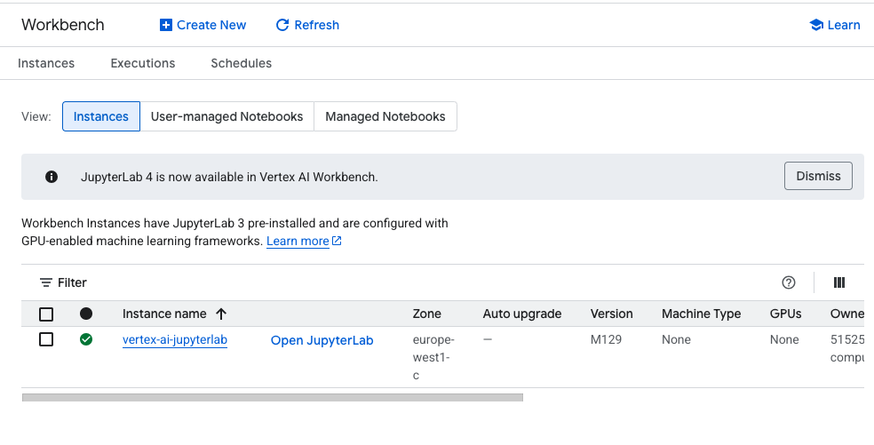


### Task 2. Set up the notebook
Open the intro_multimodal_rag file.

In the Select Kernel dialog, choose Python 3 from the list of available kernels.

Run through the Getting Started and the Import libraries sections of the notebook.

For Project ID, use qwiklabs-gcp-00-e380b94ebfaf, and for Location, use europe-west1.

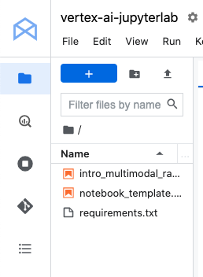


### Task 3. Use the Gemini Flash model
The Gemini 2.0 Flash (gemini-2.0-flash) model is designed to handle natural language tasks, multiturn text and code chat, and code generation. In this section, you download some helper functions needed for this notebook, to improve readability. You can also view the code (intro_multimodal_rag_utils.py) directly on GitHub.

In this task, run through the notebook cells to load the model and download the helper functions and get the documents and images from Cloud Storage.

#### Getting Started
Install Vertex AI SDK for Python and other dependencies
`%pip install --upgrade --user google-cloud-aiplatform pymupdf rich colorama`

#### Restart current runtime
To use the newly installed packages in this Jupyter runtime, you must restart the runtime. You can do this by running the cell below, which will restart the current kernel.

```
# Restart kernel after installs so that your environment can access the new packages
import IPython

app = IPython.Application.instance()
app.kernel.do_shutdown(True)
```

#### Define Google Cloud project information


```
# Define project information

import sys

PROJECT_ID = "qwiklabs-gcp-00-e380b94ebfaf"  # @param {type:"string"}
LOCATION = "europe-west1"  # @param {type:"string"}

# if not running on Colab, try to get the PROJECT_ID automatically
if "google.colab" not in sys.modules:
    import subprocess

    PROJECT_ID = subprocess.check_output(
        ["gcloud", "config", "get-value", "project"], text=True
    ).strip()

print(f"Your project ID is: {PROJECT_ID}")
```

```
import sys

# Initialize Vertex AI
import vertexai

vertexai.init(project=PROJECT_ID, location=LOCATION)
```

#### Import libraries

```
from IPython.display import Markdown, display
from rich.markdown import Markdown as rich_Markdown
from vertexai.generative_models import GenerationConfig, GenerativeModel, Image
```

#### Load the Gemini 2.0 Flash models¶

```
text_model = GenerativeModel("gemini-2.0-flash")
multimodal_model = GenerativeModel("gemini-2.0-flash")
multimodal_model_flash = GenerativeModel("gemini-2.0-flash")
```

#### Download custom Python utilities & required files
The cell below will download a helper functions needed for this notebook, to improve readability. It also downloads other required files. You can also view the code for the utils here: (intro_multimodal_rag_utils.py) directly on GitHub.


```
# download documents and images used in this notebook
!gsutil -m rsync -r gs://github-repo/rag/intro_multimodal_rag/intro_multimodal_rag_old_version .
print("Download completed")
```


### Task 4. Build metadata of documents containing text and images
The source data that you use in this lab is a modified version of Google-10K which provides a comprehensive overview of the company's financial performance, business operations, management, and risk factors. As the original document is rather large, you will be using a modified version with only 14 pages, split into two parts - Part 1 and Part 2 instead. Although it's truncated, the sample document still contains text along with images such as tables, charts, and graphs.

In this task, run through the notebook cells to extract and store metadata of text and images from a document.

>Note: The cell to to extract and store metadata of text and images from a document may take a few minutes to complete.


#### Import helper functions to build metadata
Before building the multimodal RAG system, it's important to have metadata of all the text and images in the document. For references and citations purposes, the metadata should contain essential elements, including page number, file name, image counter, and so on. Hence, as a next step, you will generate embeddings from the metadata, which will is required to perform similarity search when querying the data.


`from intro_multimodal_rag_utils import get_document_metadata`

#### Extract and store metadata of text and images from a document

You just imported a function called get_document_metadata(). This function extracts text and image metadata from a document, and returns two dataframes, namely text_metadata and image_metadata, as outputs. If you want to find out more about how get_document_metadata() function is implemented using Gemini and the embedding models, you can take look at the source code directly.

The reason for extraction and storing both text metadata and image metadata is that just by using either of the two alone is not sufficient to come out with a relevent answer. For example, the relevant answers could be in visual form within a document, but text-based RAG won't be able to take into consideration of the visual images. You will also be exploring this example later in this notebook.


```
# Specify the PDF folder with multiple PDF

# pdf_folder_path = "/content/data/" # if running in Google Colab/Colab Enterprise
pdf_folder_path = "data/"  # if running in Vertex AI Workbench.

# Specify the image description prompt. Change it
image_description_prompt = """Explain what is going on in the image.
If it's a table, extract all elements of the table.
If it's a graph, explain the findings in the graph.
Do not include any numbers that are not mentioned in the image.
"""

# Extract text and image metadata from the PDF document
text_metadata_df, image_metadata_df = get_document_metadata(
    multimodal_model,  # we are passing Gemini 2.0 Flash model
    pdf_folder_path,
    image_save_dir="images",
    image_description_prompt=image_description_prompt,
    embedding_size=1408,
    add_sleep_after_page = True,
    sleep_time_after_page = 5,
    # generation_config = # see next cell
    # safety_settings =  # see next cell
)

print("\n\n --- Completed processing. ---")

```

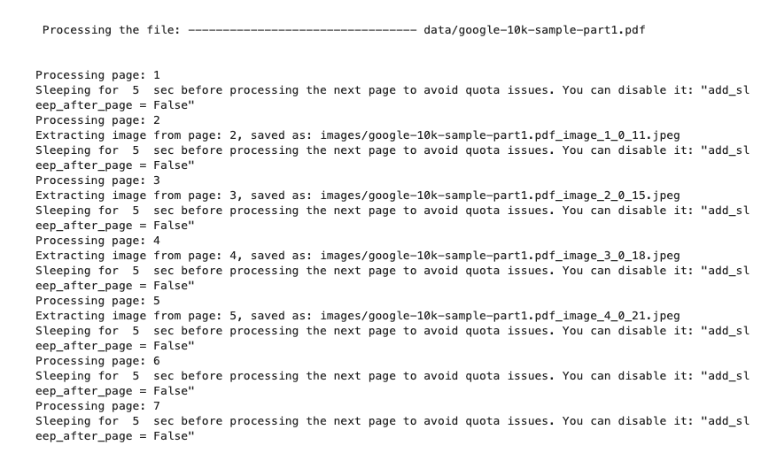
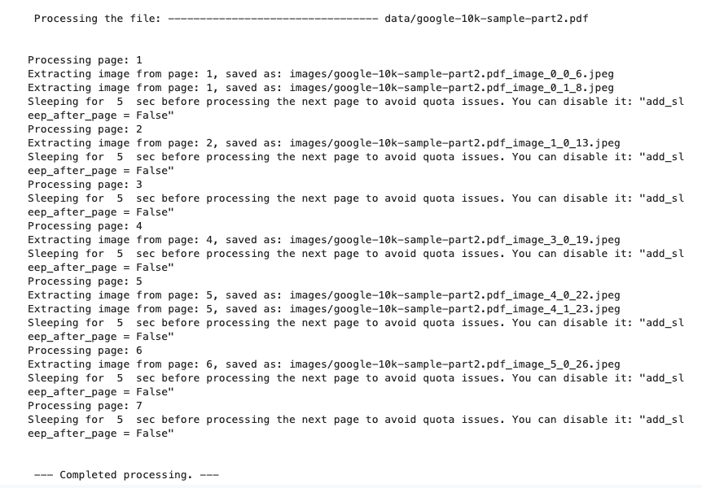

```
# # Parameters for Gemini API call.
# # reference for parameters: https://cloud.google.com/vertex-ai/docs/generative-ai/model-reference/gemini

# generation_config=  GenerationConfig(temperature=0.2, max_output_tokens=2048)

# # Set the safety settings if Gemini is blocking your content or you are facing "ValueError("Content has no parts")" error or "Exception occurred" in your data.
# # ref for settings and thresholds: https://cloud.google.com/vertex-ai/docs/generative-ai/multimodal/configure-safety-attributes

# safety_settings = {
#                   HarmCategory.HARM_CATEGORY_HARASSMENT: HarmBlockThreshold.BLOCK_NONE,
#                   HarmCategory.HARM_CATEGORY_HATE_SPEECH: HarmBlockThreshold.BLOCK_NONE,
#                   HarmCategory.HARM_CATEGORY_SEXUALLY_EXPLICIT: HarmBlockThreshold.BLOCK_NONE,
#                   HarmCategory.HARM_CATEGORY_DANGEROUS_CONTENT: HarmBlockThreshold.BLOCK_NONE,
#                   }

# # You can also pass parameters and safety_setting to "get_gemini_response" function
```


### Task 5. Text Search
Let's start the search with a simple question and see if the simple text search using text embeddings can answer it. The expected answer is to show the value of basic and diluted net income per share of Google for different share types.

In this task, run through the notebook cells to search for similar text and images with a text query.

#### Inspect the processed text metadata
The following cell will produce a metadata table which describes the different parts of text metadata, including:

text: the original text from the page
text_embedding_page: the embedding of the original text from the page
chunk_text: the original text divided into smaller chunks
chunk_number: the index of each text chunk
text_embedding_chunk: the embedding of each text chunk


#### Inspect the processed image metadata
The following cell will produce a metadata table which describes the different parts of image metadata, including:

img_desc: Gemini-generated textual description of the image.
mm_embedding_from_text_desc_and_img: Combined embedding of image and its description, capturing both visual and textual information.
mm_embedding_from_img_only: Image embedding without description, for comparison with description-based analysis.
text_embedding_from_image_description: Separate text embedding of the generated description, enabling textual analysis and comparison.


`image_metadata_df.head()`

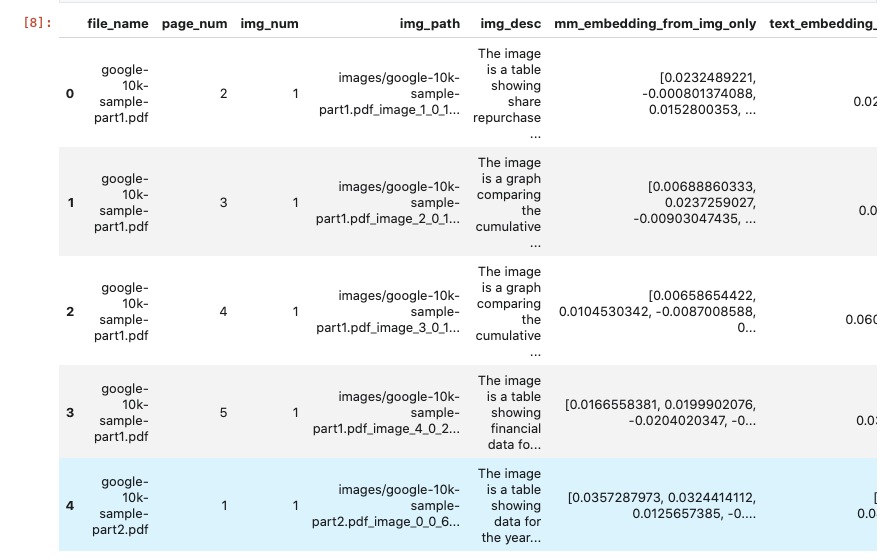

##### Import the helper functions to implement RAG

```
from intro_multimodal_rag_utils import (
    display_images,
    get_gemini_response,
    get_similar_image_from_query,
    get_similar_text_from_query,
    print_text_to_image_citation,
    print_text_to_text_citation,
)
```

#### Text Search

```
query = "I need details for basic and diluted net income per share of Class A, Class B, and Class C share for google?"
```

#### Search similar text with text query
```
# Matching user text query with "chunk_embedding" to find relevant chunks.
matching_results_text = get_similar_text_from_query(
    query,
    text_metadata_df,
    column_name="text_embedding_chunk",
    top_n=3,
    chunk_text=True,
)

# Print the matched text citations
print_text_to_text_citation(matching_results_text, print_top=False, chunk_text=True)
```
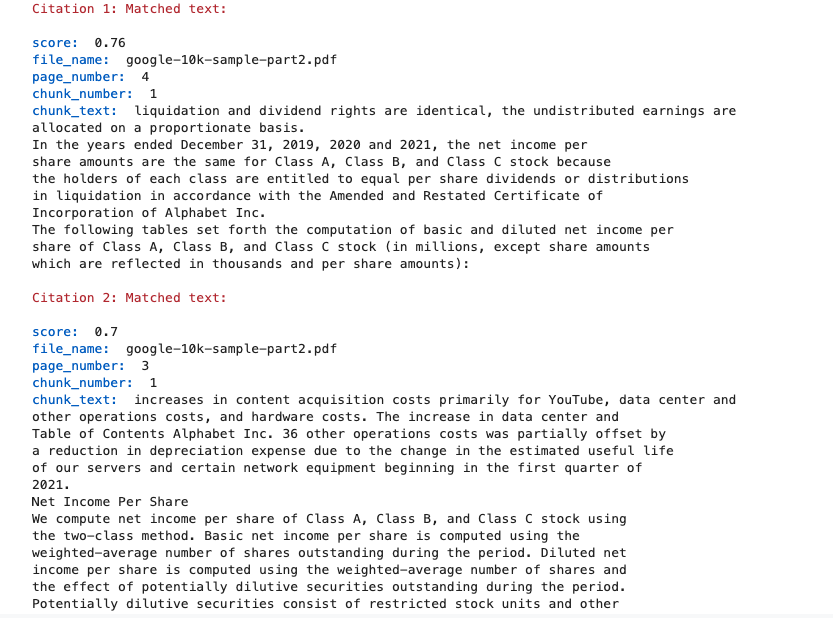
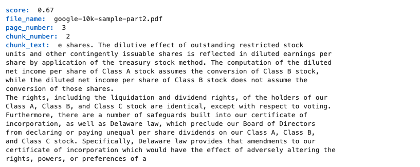


You can see that the first high score match does have what we are looking for, but upon closer inspection, it mentions that the information is available in the "following" table. The table data is available as an image rather than as text, and hence, the chances are you will miss the information unless you can find a way to process images and their data.

However, Let's feed the relevant text chunk across the data into the Gemini 2.0 Flash model and see if it can get your desired answer by considering all the chunks across the document. This is like basic text-based RAG implementation.


```
print("\n **** Result: ***** \n")

# All relevant text chunk found across documents based on user query
context = "\n".join(
    [value["chunk_text"] for key, value in matching_results_text.items()]
)

instruction = f"""Answer the question with the given context.
If the information is not available in the context, just return "not available in the context".
Question: {query}
Context: {context}
Answer:
"""

# Prepare the model input
model_input = instruction

# Generate Gemini response with streaming output
get_gemini_response(
    text_model,  # we are passing Gemini 2.0 Flash
    model_input=model_input,
    stream=True,
    generation_config=GenerationConfig(temperature=0.2),
)
```

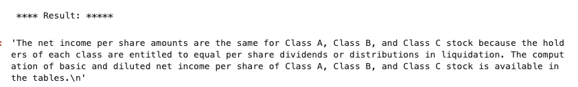


#### Search similar images with text query
Since plain text search didn't provide the desired answer and the information may be visually represented in a table or another image format, you will use multimodal capability of Gemini 2.0 Flash model for the similar task. The goal here also is to find an image similar to the text query. You may also print the citations to verify.

`query = "I need details for basic and diluted net income per share of Class A, Class B, and Class C share for google?"`

```
matching_results_image = get_similar_image_from_query(
    text_metadata_df,
    image_metadata_df,
    query=query,
    column_name="text_embedding_from_image_description",  # Use image description text embedding
    image_emb=False,  # Use text embedding instead of image embedding
    top_n=3,
    embedding_size=1408,
)

# Markdown(print_text_to_image_citation(matching_results_image, print_top=True))
print("\n **** Result: ***** \n")

# Display the top matching image
display(matching_results_image[0]["image_object"])
```

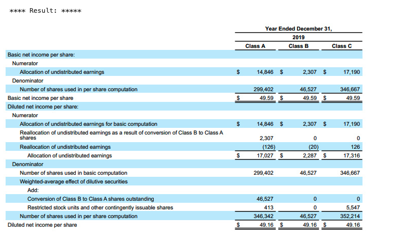


Bingo! It found exactly what you were looking for. You wanted the details on Google's Class A, B, and C shares' basic and diluted net income, and guess what? This image fits the bill perfectly thanks to its descriptive metadata using Gemini.

You can also send the image and its description to Gemini 2.0 Flash and get the answer as JSON:

```
print("\n **** Result: ***** \n")

# All relevant text chunk found across documents based on user query
context = f"""Image: {matching_results_image[0]['image_object']}
Description: {matching_results_image[0]['image_description']}
"""

instruction = f"""Answer the question in JSON format with the given context of Image and its Description. Only include value.
Question: {query}
Context: {context}
Answer:
"""

# Prepare the model input
model_input = instruction

# Generate Gemini response with streaming output
Markdown(
    get_gemini_response(
        multimodal_model_flash,  # we are passing Gemini 2.0 Flash
        model_input=model_input,
        stream=True,
        generation_config=GenerationConfig(temperature=1),
    )
)
```


```
print("\n **** Result: ***** \n")

# All relevant text chunk found across documents based on user query
context = f"""Image: {matching_results_image[0]['image_object']}
Description: {matching_results_image[0]['image_description']}
"""

instruction = f"""Answer the question in JSON format with the given context of Image and its Description. Only include value.
Question: {query}
Context: {context}
Answer:
"""

# Prepare the model input
model_input = instruction

# Generate Gemini response with streaming output
Markdown(
    get_gemini_response(
        multimodal_model_flash,  # we are passing Gemini 2.0 Flash
        model_input=model_input,
        stream=True,
        generation_config=GenerationConfig(temperature=1),
    )
)
```
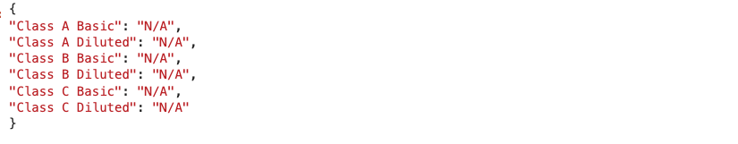

```
## you can check the citations to probe further.
## check the "image description:" which is a description extracted through Gemini which helped search our query.
Markdown(print_text_to_image_citation(matching_results_image, print_top=True))
```
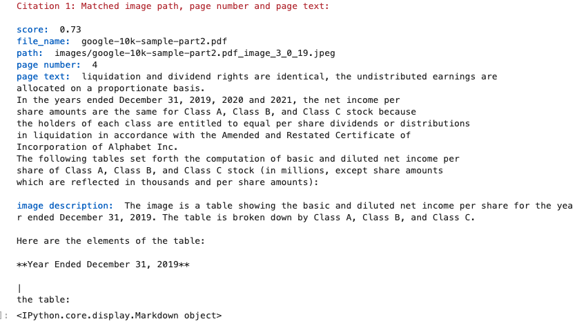


### Task 6. Image Search
Imagine searching for images, but instead of typing words, you use an actual image as the clue. You have a table with numbers about the cost of revenue for two years, and you want to find other images that look like it, from the same document or across multiple documents.

The ability to identify similar text and images based on user input, powered with Gemini and embeddings, forms a crucial foundation for the development of multimodal RAG systems, which explore in the next task.

In this task, run through the notebook cells to search for similar images with an image query.
Note: You may need to wait for a couple of minutes to get the score for this task.

```
# You can find a similar image as per the images you have in the metadata.
# In this case, you have a table (picked from the same document source) and you would like to find similar tables in the document.
image_query_path = "tac_table_revenue.png"

# Print a message indicating the input image
print("***Input image from user:***")

# Display the input image
Image.load_from_file(image_query_path)
```


```
# Search for Similar Images Based on Input Image and Image Embedding

matching_results_image = get_similar_image_from_query(
    text_metadata_df,
    image_metadata_df,
    query=query,  # Use query text for additional filtering (optional)
    column_name="mm_embedding_from_img_only",  # Use image embedding for similarity calculation
    image_emb=True,
    image_query_path=image_query_path,  # Use input image for similarity calculation
    top_n=3,  # Retrieve top 3 matching images
    embedding_size=1408,  # Use embedding size of 1408
)

print("\n **** Result: ***** \n")

# Display the Top Matching Image
display(
    matching_results_image[0]["image_object"]
)  # Display the top matching image object (Pillow Image)
```
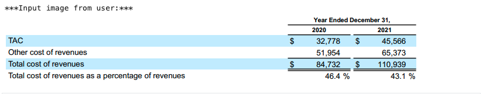


You expect to find tables (as images) that are similar in terms of "Other/Total cost of revenues."


```
# Search for Similar Images Based on Input Image and Image Embedding

matching_results_image = get_similar_image_from_query(
    text_metadata_df,
    image_metadata_df,
    query=query,  # Use query text for additional filtering (optional)
    column_name="mm_embedding_from_img_only",  # Use image embedding for similarity calculation
    image_emb=True,
    image_query_path=image_query_path,  # Use input image for similarity calculation
    top_n=3,  # Retrieve top 3 matching images
    embedding_size=1408,  # Use embedding size of 1408
)

print("\n **** Result: ***** \n")

# Display the Top Matching Image
display(
    matching_results_image[0]["image_object"]
)  # Display the top matching image object (Pillow Image)

```
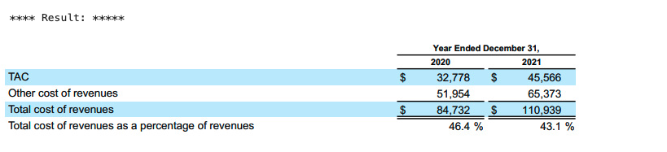


You can also print the citation to see what it has matched.
```
# Display citation details for the top matching image
print_text_to_image_citation(
    matching_results_image, print_top=True
)  # Print citation details for the top matching image
```

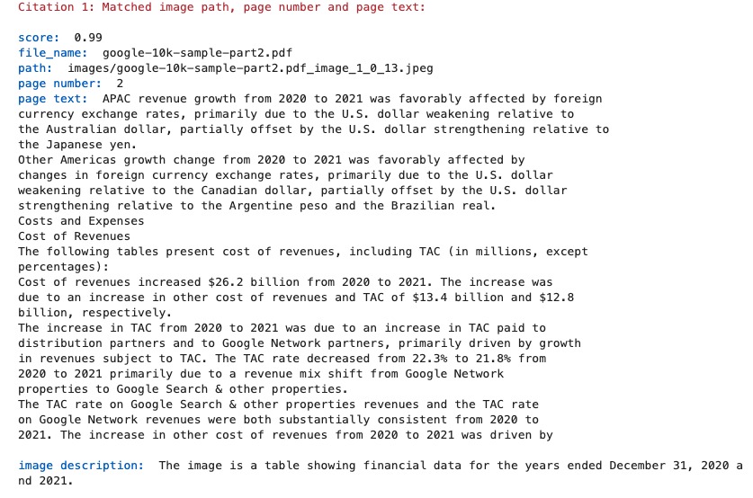
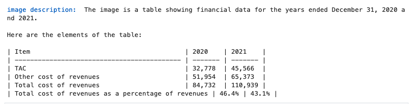

```
# Check Other Matched Images (Optional)
# You can access the other two matched images using:

print("---------------Matched Images------------------\n")
display_images(
    [
        matching_results_image[0]["img_path"],
        matching_results_image[1]["img_path"],
    ],
    resize_ratio=0.5,
)
```
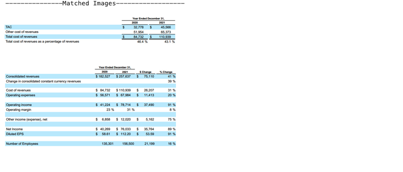


#### Comparative Reasoning
Imagine we have a graph showing how Class A Google shares did compared to other things like the S&P 500 or other tech companies. You want to know how Class C shares did compared to that graph. Instead of just finding another similar image, you can ask Gemini to compare the relevant images and tell you which stock might be better for you to invest in. Gemini would then explain why it thinks that way.

In this task, run through the notebook cells to compare two images and find the most similar image.


```
matching_results_image_query_1 = get_similar_image_from_query(
    text_metadata_df,
    image_metadata_df,
    query="Show me all the graphs that shows Google Class A cumulative 5-year total return",
    column_name="text_embedding_from_image_description",  # Use image description text embedding # mm_embedding_from_img_only text_embedding_from_image_description
    image_emb=False,  # Use text embedding instead of image embedding
    top_n=3,
    embedding_size=1408,
)
```

```
# Check Matched Images
# You can access the other two matched images using:

print("---------------Matched Images------------------\n")
display_images(
    [
        matching_results_image_query_1[0]["img_path"],
        matching_results_image_query_1[1]["img_path"],
    ],
    resize_ratio=0.5,
)
```
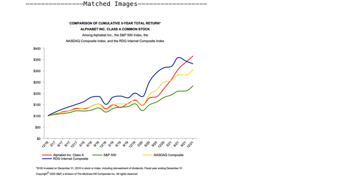
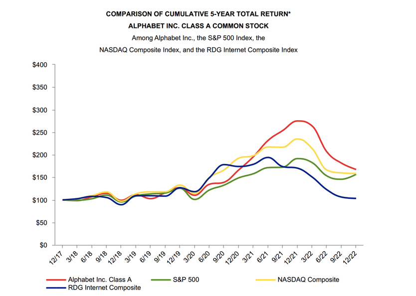

```
prompt = f""" Instructions: Compare the images and the Gemini extracted text provided as Context: to answer Question:
Make sure to think thoroughly before answering the question and put the necessary steps to arrive at the answer in bullet points for easy explainability.

Context:
Image_1: {matching_results_image_query_1[0]["image_object"]}
gemini_extracted_text_1: {matching_results_image_query_1[0]['image_description']}
Image_2: {matching_results_image_query_1[1]["image_object"]}
gemini_extracted_text_2: {matching_results_image_query_1[2]['image_description']}

Question:
 - Key findings of Class A share?
 - What are the critical differences between the graphs for Class A Share?
 - What are the key findings of Class A shares concerning the S&P 500?
 - Which index best matches Class A share performance closely where Google is not already a part? Explain the reasoning.
 - Identify key chart patterns in both graphs.
 - Which index best matches Class A share performance closely where Google is not already a part? Explain the reasoning.
"""

# Generate Gemini response with streaming output
rich_Markdown(
    get_gemini_response(
        multimodal_model,  # we are passing Gemini 2.0 Flash
        model_input=[prompt],
        stream=True,
        generation_config=GenerationConfig(temperature=1),
    )
)
```

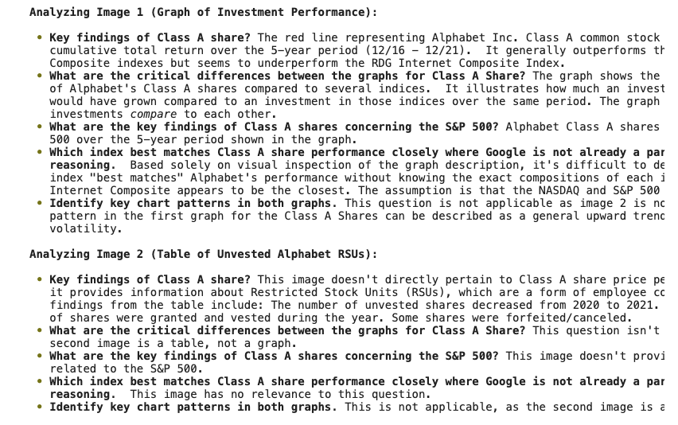
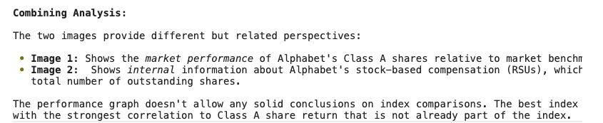


### Task 7. Multimodal retrieval augmented generation (RAG)
Let's bring everything together to implement multimodal RAG. You use all the elements that you've explored in previous sections to implement the multimodal RAG. These are the steps:

Step 1: The user gives a query in text format where the expected information is available in the document and is embedded in images and text.
Step 2: Find all text chunks from the pages in the documents using a method similar to the one you explored in Text Search.
Step 3: Find all similar images from the pages based on the user query matched with image_description using a method identical to the one you explored in Image Search.
Step 4: Combine all similar text and images found in steps 2 and 3 as context_text and context_images.
Step 5: With the help of Gemini, we can pass the user query with text and image context found in steps 2 & 3. You can also add a specific instruction the model should remember while answering the user query.
Step 6: Gemini produces the answer, and you can print the citations to check all relevant text and images used to address the query.
In this task, run through the notebook cells to perform multimodal RAG.
Note: You may need to wait for a couple of minutes to get the score for this task.

#### Step 1: User query¶

```
# this time we are not passing any images, but just a simple text query.

query = """Questions:
 - What are the critical difference between various graphs for Class A Share?
 - Which index best matches Class A share performance closely where Google is not already a part? Explain the reasoning.
 - Identify key chart patterns for Google Class A shares.
 - What is cost of revenues, operating expenses and net income for 2020. Do mention the percentage change
 - What was the effect of Covid in the 2020 financial year?
 - What are the total revenues for APAC and USA for 2021?
 - What is deferred income taxes?
 - How do you compute net income per share?
 - What drove percentage change in the consolidated revenue and cost of revenue for the year 2021 and was there any effect of Covid?
 - What is the cause of 41% increase in revenue from 2020 to 2021 and how much is dollar change?
 """
```

#### Step 2: Get all relevant text chunks

```
# Retrieve relevant chunks of text based on the query
matching_results_chunks_data = get_similar_text_from_query(
    query,
    text_metadata_df,
    column_name="text_embedding_chunk",
    top_n=10,
    chunk_text=True,
)
```

#### Step 3: Get all relevant images
```
# Get all relevant images based on user query
matching_results_image_fromdescription_data = get_similar_image_from_query(
    text_metadata_df,
    image_metadata_df,
    query=query,
    column_name="text_embedding_from_image_description",
    image_emb=False,
    top_n=10,
    embedding_size=1408,
)
```
#### Step 4: Create context_text and context_images

```
# combine all the selected relevant text chunks
context_text = []
for key, value in matching_results_chunks_data.items():
    context_text.append(value["chunk_text"])
final_context_text = "\n".join(context_text)

# combine all the relevant images and their description generated by Gemini
context_images = []
for key, value in matching_results_image_fromdescription_data.items():
    context_images.extend(
        ["Image: ", value["image_object"], "Caption: ", value["image_description"]]
    )
```

#### Step 5: Pass context to Gemini

```
prompt = f""" Instructions: Compare the images and the text provided as Context: to answer multiple Question:
Make sure to think thoroughly before answering the question and put the necessary steps to arrive at the answer in bullet points for easy explainability.
If unsure, respond, "Not enough context to answer".

Context:
 - Text Context:
 {final_context_text}
 - Image Context:
 {context_images}

{query}

Answer:
"""

# Generate Gemini response with streaming output
rich_Markdown(
    get_gemini_response(
        multimodal_model,
        model_input=[prompt],
        stream=True,
        generation_config=GenerationConfig(temperature=1),
    )
)
```

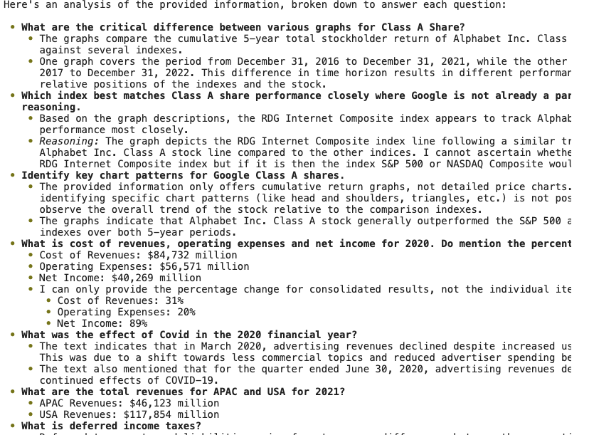
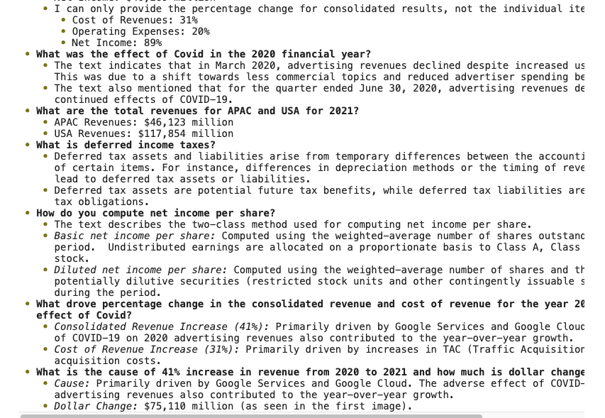


Step 6: Print citations and references
```
print("---------------Matched Images------------------\n")
display_images(
    [
        matching_results_image_fromdescription_data[0]["img_path"],
        matching_results_image_fromdescription_data[1]["img_path"],
        matching_results_image_fromdescription_data[2]["img_path"],
        matching_results_image_fromdescription_data[3]["img_path"],
    ],
    resize_ratio=0.5,
)
```
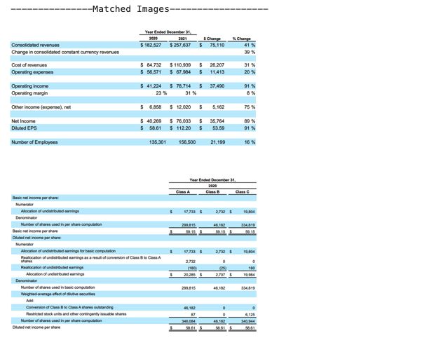
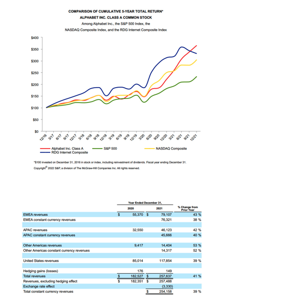

```
# Image citations. You can check how Gemini generated metadata helped in grounding the answer.

print_text_to_image_citation(
    matching_results_image_fromdescription_data, print_top=False
)
```

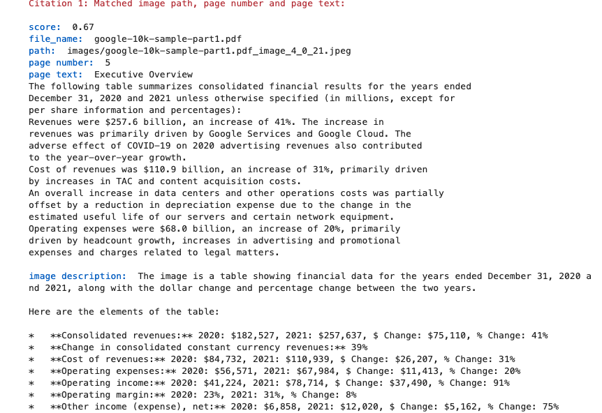
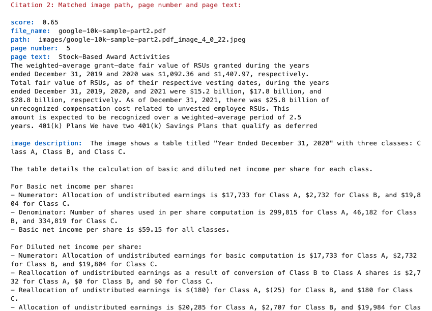
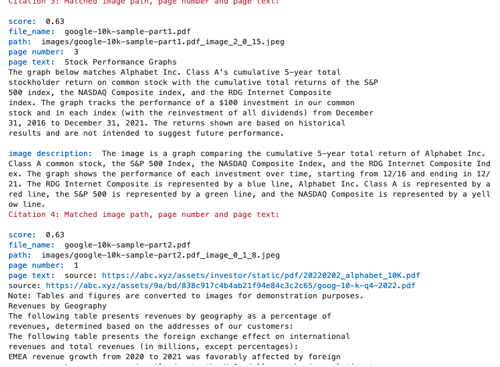
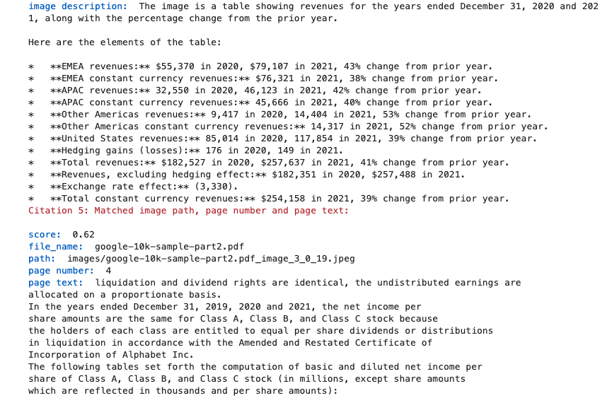
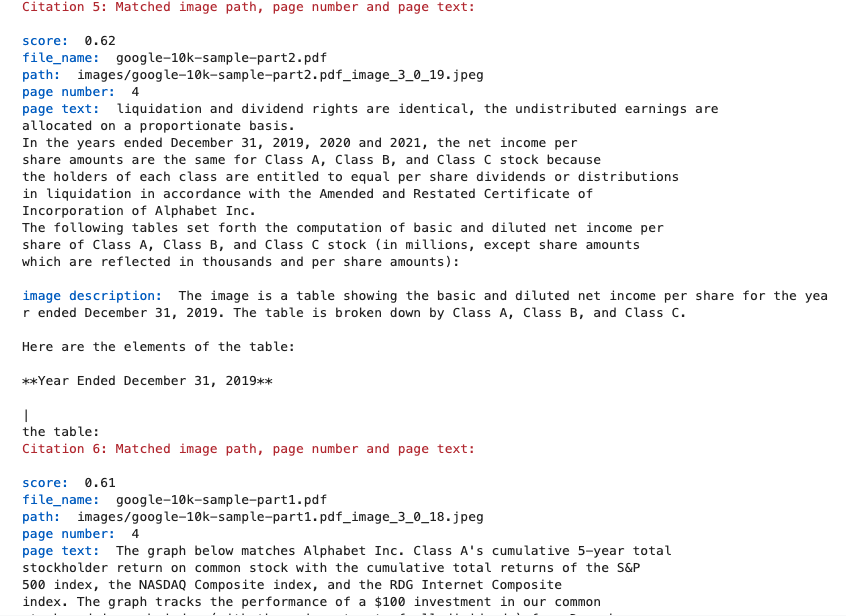


```
# Text citations

print_text_to_text_citation(
    matching_results_chunks_data,
    print_top=False,
    chunk_text=True,
)
```

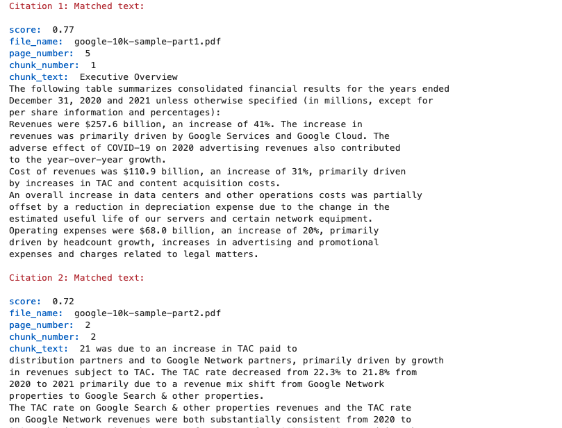
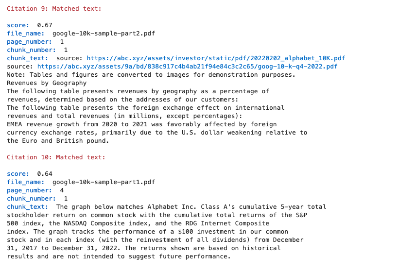


### Congratulations!
In this lab, you've learned to build a robust document search engine using Multimodal Retrieval Augmented Generation (RAG). You learned how to extract and store metadata of documents containing both text and images, and generate embeddings for the documents. You also learned how to search the metadata with text and image queries to find similar text and images. Finally, you learned how to use a text query as input to search for contextual answers using both text and images.

Next steps / learn more
Check out the following resources to learn more about Gemini:

Gemini Overview
Generative AI on Vertex AI Documentation
Generative AI on YouTube
Explore the Vertex AI Cookbook for a curated, searchable gallery of notebooks for Generative AI.
Explore other notebooks and samples in the Google Cloud Generative AI repository.


